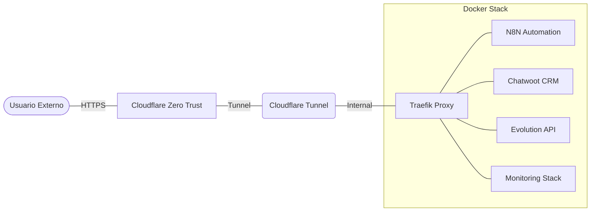

# 🔒 Infraestructura Zero Trust: N8N + Chatwoot

Infraestructura completa y segura basada en Docker, utilizando **Cloudflare Zero Trust** y **Traefik** para un acceso remoto protegido sin exposición de puertos.

## 🏗️ Arquitectura de Red

## 🚀 Características Principales

- **Acceso Seguro**: Autenticación centralizada vía Cloudflare Zero Trust.
- **Automatización**: Stack completo de N8N para workflows inteligentes.
- **CRM & WhatsApp**: Chatwoot integrado con Evolution API.
- **Monitoreo**: Dashboards en Grafana con métricas de Prometheus.
- **Simplicidad**: Gestión unificada mediante el script `manage_all.sh`.

## 📁 Estructura del Proyecto

- `chatwoot_files/`: CRM y atención al cliente.
- `evoapi_files/`: Integración con WhatsApp.
- `n8n_files/`: Automatización de flujos de trabajo.
- `monitoring/`: Prometheus, Grafana y exportadores.
- `utilidades/`: Servicios auxiliares y Cloudflare Tunnel.

## 🛠️ Inicio Rápido

1. **Configurar Entorno**: Ejecutar `./manage_all.sh start`.
2. **Zero Trust**: Configurar el túnel en `utilidades/`.
3. **Documentación**: Consultar la [Guía de Despliegue](DEPLOYMENT_GUIDE.md) para pasos detallados.

## 📚 Documentación Adicional

- [📖 Guía de Despliegue y Troubleshooting](DEPLOYMENT_GUIDE.md)
- [🔒 Configuración Zero Trust](utilidades/README-ZeroTrust.md)

---

_Estado del proyecto: ✅ Operativo | Última actualización: Febrero 2026_
