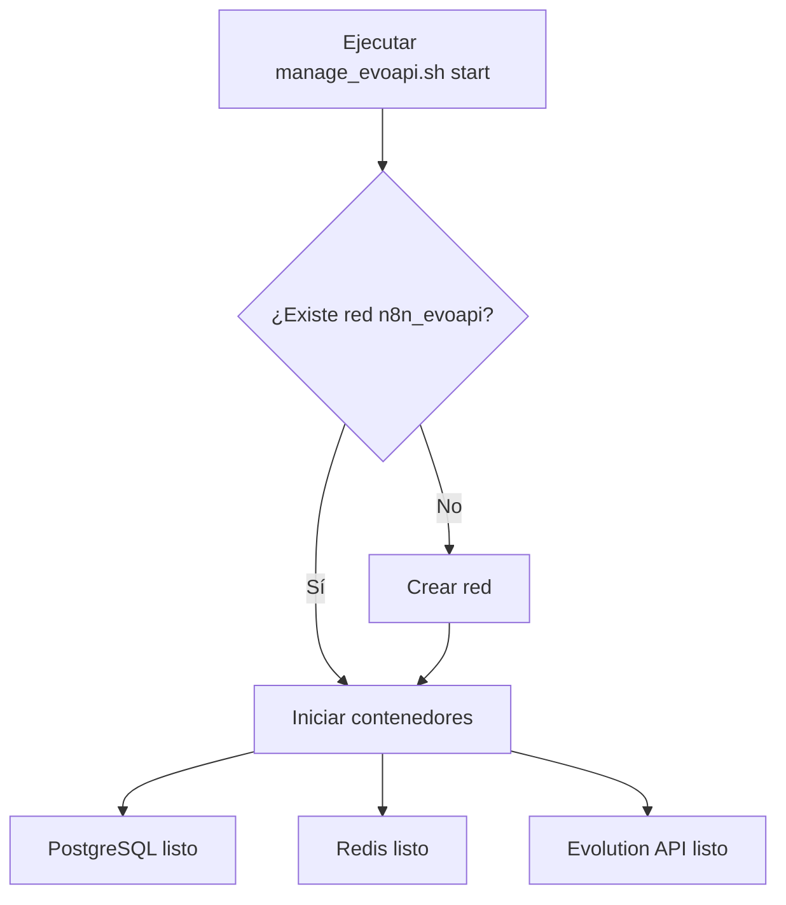
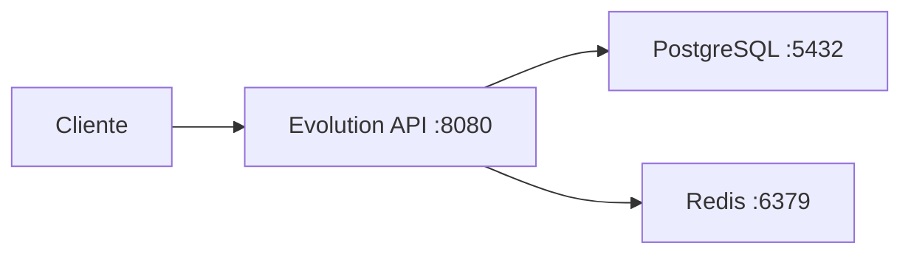

# EvoAPI - Evolution API Setup

Este proyecto configura la Evolution API utilizando Docker Compose, con PostgreSQL y Redis como servicios backend.

## Arquitectura

```
+----------------+     +----------------+     +----------------+
|   Evolution    |     |   PostgreSQL   |     |     Redis      |
|     API        |<--->|     (DB)       |     |   (Cache)      |
|   (Puerto 8080)|     |                |     |                |
+----------------+     +----------------+     +----------------+
         ^
         |
+----------------+
|   Cliente       |
|   (WhatsApp)   |
+----------------+
```

### Servicios

- **Evolution API**: API principal para integración con WhatsApp. Expone el puerto 8080.
- **PostgreSQL**: Base de datos para almacenar datos persistentes. No expuesto externamente.
- **Redis**: Cache para mejorar el rendimiento. No expuesto externamente.

### Integración con Chatwoot

Evolution API se integra con Chatwoot para proporcionar soporte WhatsApp completo:
- Recepción y envío de mensajes
- Gestión de contactos y conversaciones
- Webhooks para eventos en tiempo real
- Soporte para múltiples instancias

### Red

Todos los servicios están conectados a la red Docker externa `n8n_evoapi`.

## Estructura de Archivos

```
evoapi_files/
├── docker-compose.yml    # Configuración de Docker Compose
├── .env                  # Variables de entorno
├── .env.example          # Ejemplo de variables de entorno
├── manage_evoapi.sh      # Script de gestión automática
└── README.md             # Este archivo
```

## Requisitos Previos

- Docker y Docker Compose instalados.
- Red externa `n8n_evoapi` (creada automáticamente por el script).

## Instalación y Uso

### 1. Configurar Variables de Entorno

Copia el archivo de ejemplo y configura las variables:

```bash
cp .env.example .env
# Edita .env con tus valores
```

### 2. Usar el Script de Gestión

El script `manage_evoapi.sh` valida la red y gestiona los contenedores:

```bash
# Hacer ejecutable el script (una vez)
chmod +x manage_evoapi.sh

# Iniciar contenedores
./manage_evoapi.sh start

# Detener contenedores
./manage_evoapi.sh stop
```

### 3. Verificar Estado

```bash
docker compose -f docker-compose.yml ps
```

### 4. Ver Logs

```bash
docker compose -f docker-compose.yml logs -f
```

## Configuración

### Variables de Entorno (.env)

#### Básicas
- `AUTHENTICATION_API_KEY`: Clave de autenticación para la API.
- `EVOLUTION_API_KEY`: Clave principal de Evolution API.
- `SESSION_MODE`: Modo de sesión (chrome por defecto).

#### Base de Datos
- `DATABASE_*`: Configuración de PostgreSQL.
- `CACHE_REDIS_*`: Configuración de Redis.

#### Integración Chatwoot
- `CHATWOOT_ENABLED`: Habilitar integración con Chatwoot (true).
- `CHATWOOT_BASE_URL`: URL base de la instancia de Chatwoot.
- `CHATWOOT_API_ACCESS_TOKEN`: Token de API de Chatwoot.
- `CHATWOOT_ACCOUNT_ID`: ID de cuenta en Chatwoot.
- `CHATWOOT_SIGN_MSG`: Firmar mensajes (true/false).
- `CHATWOOT_REOPEN_CONVERSATION`: Reabrir conversaciones (true/false).

### Puertos

- Evolution API: `8080` (expuesto)
- PostgreSQL: `5432` (interno)
- Redis: `6379` (interno)

## Diagramas de Flujo

### Inicio de Servicios



### Comunicación



## Solución de Problemas

### Error de Conexión a Redis

- Verificar que `CACHE_REDIS_*` en `.env` estén correctos.
- Revisar logs: `docker compose logs evolution_api`

### Red No Encontrada

- El script crea la red automáticamente.
- Manual: `docker network create n8n_evoapi`

### Puertos Ocupados

- Cambiar puertos en `docker-compose.yml` si es necesario.

## Contribución

Para modificar la configuración:

1. Editar `docker-compose.yml` o `.env`.
2. Reiniciar: `./manage_evoapi.sh stop && ./manage_evoapi.sh start`

## Licencia

Este proyecto es parte de la infraestructura de N8N Chatwoot.